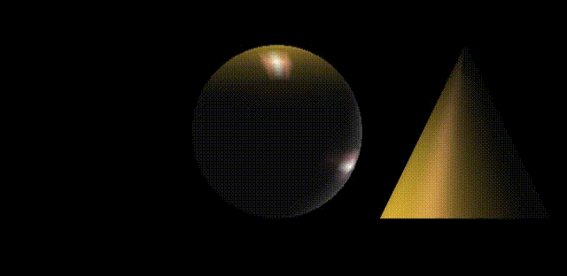
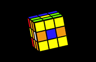
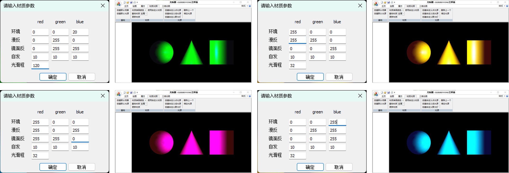

# Experiments in Computer Graphics

基于MFC+OpenGL的二维图形和三维图像计算机图形学实验

## 项目简介

本项目是一个计算机图形学实验，专注于二维图形和三维图像的生成与处理，基于Microsoft Foundation Classes (MFC) 和 OpenGL。项目旨在提供一个实验平台，用于学习和探索图形生成的基础理论和实践应用。

## 主要功能

  

- 二维图形的交互式绘制与操作
- 二维图形的变换和裁剪
- 三维图形的空间变换
- 三维3阶魔方交互式操作
- 三维图像的生成和渲染
- 光照、纹理和材质的应用
- 图形和图像的交互式编辑

## 安装指南

本项目需要配置Visual Studio环境，并安装OpenGL库。具体步骤如下：

1. 确保您的计算机上安装了Visual Studio。
2. 下载并安装OpenGL库文件。
3. 克隆或下载本项目代码到本地。
4. 使用Visual Studio打开项目文件，编译并运行。

## 使用技术

- C++：用于实现项目的核心功能。
- MFC：用于创建图形用户界面。
- OpenGL：用于渲染二维和三维图形。

## 如何贡献

欢迎对本项目进行贡献！您可以通过以下方式帮助改进项目：

- 提交Bug报告和功能请求
- 提交Pull请求以添加新功能或解决问题

## 版权和许可

本项目遵循MIT许可协议。详细内容请查阅[LICENSE](LICENSE)文件。